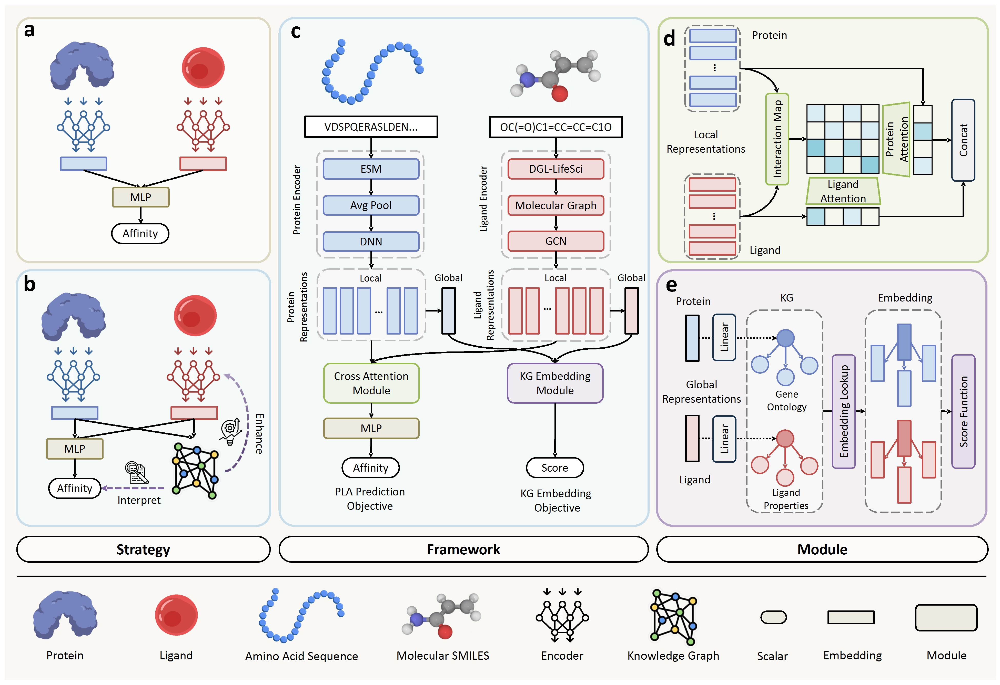

# KEPLA
# KEPLA: A Knowledge-Enhanced Deep Learning Framework for Accurate Protein-Ligand Binding Affinity Prediction | [Paper](https://arxiv.org/abs/2506.13196)


<div align="left">

[](https://github.com/hanliu95/KEPLA/tree/main/LICENSE)
</div>

## Introduction
This repository contains the PyTorch implementation of **KEPLA** framework. KEPLA is an end-to-end knowledge-enhanced deep learning framework for protein-ligand binding affinity (PLA) prediction, designed to address the performance bottlenecks and limited interpretability of existing methods.  It works on target protein sequences and ligand molecular graphs to perform prediction.
## Framework

## System Requirements
The source code developed in Python 3.8 using PyTorch 1.7.1. The required python dependencies are given below. KEPLA is supported for any standard computer and operating system (Windows/macOS/Linux) with enough RAM to run. There is no additional non-standard hardware requirements.

```
torch>=1.7.1
dgl>=0.7.1
dgllife>=0.2.8
numpy>=1.20.2
scikit-learn>=0.24.2
pandas>=1.2.4
prettytable>=2.2.1
rdkit~=2021.03.2
yacs~=0.1.8
```
## Installation Guide
Clone this Github repo and set up a new conda environment. It normally takes about 10 minutes to install on a normal desktop computer.
```
# create a new conda environment
$ conda create --name kepla python=3.8
$ conda activate kepla

# install requried python dependencies
$ conda install pytorch==1.7.1 torchvision==0.8.2 torchaudio==0.7.2 cudatoolkit=10.2 -c pytorch
$ conda install -c dglteam dgl-cuda10.2==0.7.1
$ conda install -c conda-forge rdkit==2021.03.2
$ pip install dgllife==0.2.8
$ pip install -U scikit-learn
$ pip install yacs
$ pip install prettytable

# clone the source code of KEPLA
$ git clone https://github.com/hanliu95/KEPLA.git
$ cd KEPLA
```


## Datasets
The PDBbind dataset [1] can be downloaded [here](http://pdbbind-cn.org).

The CSAR-HiQ dataset [2] can be downloaded [here](http://www.csardock.org).

You may need to use the [UCSF Chimera tool](https://www.cgl.ucsf.edu/chimera/) to convert the PDB-format files into MOL2-format files for feature extraction at first.

Alternatively, we also provided a [dropbox link](https://www.dropbox.com/sh/2uih3c6fq37qfli/AAD-LHXSWMLAuGWzcQLk5WI3a) for downloading PDBbind and CSAR-HiQ datasets.

The downloaded dataset should be preprocessed to obtain features and spatial coordinates:
```
python preprocess_pdbbind.py --data_path_core YOUR_DATASET_PATH --data_path_refined YOUR_DATASET_PATH --dataset_name pdbbind2016 --output_path YOUR_OUTPUT_PATH --cutoff 5
```

## Run KEPLA on Our Data to Reproduce Results

To train KEPLA, where we provide the basic configurations for all hyperparameters in `config.py`. For different in-domain and cross-domain tasks, the customized task configurations can be found in respective `configs/*.yaml` files.

For the in-domain experiments with KEPLA, you can directly run the following command. `${dataset}` could either be `pdbbind` or `csar`.
```
$ python main.py --cfg "configs/KEPLA.yaml" --data ${dataset} --split "cluster"
```

For the cross-domain experiments with KEPLA, you can directly run the following command. `${dataset}` could be `pdbbind`.
```
$ python main.py --cfg "configs/KEPLA.yaml" --data ${dataset} --split "cluster"
```
For the cold experiments with KEPLA, you can directly run the following command. `${dataset}` could be `pdbbind`.
```
$ python main.py --cfg "configs/KEPLA.yaml" --data ${dataset} --split "cold"
```

## Acknowledgements
This implementation is inspired and partially based on earlier work [3].

## References
    [1] Liu, Zhihai, et al. "PDB-wide collection of binding data: current status of the PDBbind database." Bioinformatics 31.3 (2015): 405-412.
    [2] Smith, Richard D., et al. "CSAR benchmark exercise of 2010: combined evaluation across all submitted scoring functions." Journal of Chemical Information and Modeling 51.9 (2011): 2115-2131.
    [3] Bai, Peizhen, et al. "Interpretable bilinear attention network with domain adaptation improves drug–target prediction." Nature Machine Intelligence 5.2 (2023): 126-136.
